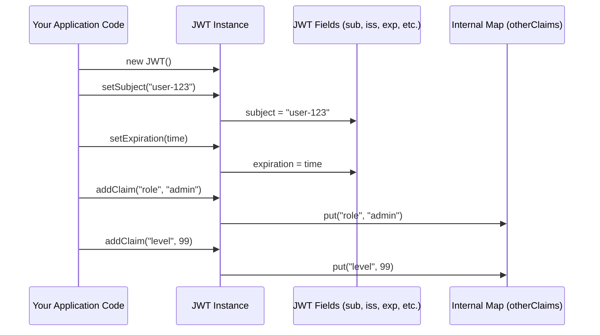

# Chapter 1: JWT (JSON Web Token) Object

Welcome to the `fusionauth-jwt` library tutorial! We're excited to help you learn about JSON Web Tokens (JWTs) and how to use this library to work with them.

Let's start with a common scenario: Imagine you log into a website. How does the website remember you're logged in when you click around to different pages? It needs a way to identify you without asking for your password every single time. This is where JWTs come in handy!

## What is a JWT Object? The Digital Passport

Think of a JWT as a **digital passport** or an **ID card**. It's a compact and secure way for systems to pass information about you (or some other subject) back and forth.

In our library, the `JWT` object is the **heart** of this concept. It represents the actual JSON Web Token *before* it gets turned into the final, encoded string you often see (which looks like `xxxxx.yyyyy.zzzzz`).

This `JWT` object holds two main things:

1.  **Payload (Claims):** This is like the main page of your passport. It contains specific pieces of information called "claims". Claims are just statements about something or someone. Examples include:
    *   Who issued the passport (`issuer`)
    *   Who the passport is for (`subject`)
    *   When the passport expires (`expiration`)
    *   What permissions the holder has (custom claims like `roles` or `permissions`)
2.  **Header:** This is like the cover and front page of your passport. It contains metadata *about* the token itself, such as:
    *   The type of token (`typ`, usually "JWT")
    *   The algorithm used to sign it (`alg`) - think of this as the security feature that prevents tampering. We'll cover signing later!

You'll create this `JWT` object in your code, fill it with the necessary claims (like adding your name and expiration date to the passport), and then use other parts of this library to sign it and turn it into the final encoded string.

## Creating Your First JWT Object

Let's see how simple it is to create a basic `JWT` object representing a user's session.

```java
import io.fusionauth.jwt.domain.JWT;
import java.time.ZoneOffset;
import java.time.ZonedDateTime;

// Create a new, empty JWT object
JWT jwt = new JWT();

// Let's add some standard "claims" (information)

// 1. Subject ('sub'): Who the token is about (e.g., the user's ID)
jwt.setSubject("user-12345");

// 2. Issuer ('iss'): Who created the token (e.g., your application)
jwt.setIssuer("https://myapp.example.com");

// 3. Expiration ('exp'): When the token becomes invalid
//    Let's set it to expire 1 hour from now.
ZonedDateTime expirationTime = ZonedDateTime.now(ZoneOffset.UTC).plusHours(1);
jwt.setExpiration(expirationTime);

// 4. Issued At ('iat'): When the token was created
jwt.setIssuedAt(ZonedDateTime.now(ZoneOffset.UTC));

System.out.println("JWT object created for subject: " + jwt.subject);
System.out.println("Expires at: " + jwt.expiration);
```

**Explanation:**

*   We import the necessary classes (`JWT`, `ZoneOffset`, `ZonedDateTime`).
*   `new JWT()` creates an empty JWT container.
*   We use methods like `setSubject()`, `setIssuer()`, `setExpiration()`, and `setIssuedAt()` to add standard, well-known claims defined in the JWT specification (RFC 7519).
*   Notice we use `ZonedDateTime` for time-based claims. The library handles converting this to the correct format (Unix timestamp) when the JWT is finally encoded.

This code creates the *representation* of the JWT in memory. It doesn't produce the final `xxxxx.yyyyy.zzzzz` string yet – that comes later when we encode and sign it.

## Adding Custom Information (Private Claims)

Besides the standard claims like `sub` or `exp`, you often need to include application-specific information. For example, maybe you want to include the user's role or their membership level. These are called "private claims".

You can easily add these using the `addClaim` method.

```java
import io.fusionauth.jwt.domain.JWT;
import java.time.ZoneOffset;
import java.time.ZonedDateTime;
import java.util.List;

// Create a new JWT (or use the one from the previous example)
JWT jwt = new JWT()
    .setSubject("user-12345")
    .setIssuer("https://myapp.example.com")
    .setExpiration(ZonedDateTime.now(ZoneOffset.UTC).plusHours(1));

// Add custom claims
jwt.addClaim("user_role", "administrator");
jwt.addClaim("premium_member", true);
jwt.addClaim("permissions", List.of("read", "write", "delete")); // Can be lists too!

System.out.println("User role: " + jwt.getString("user_role"));
System.out.println("Is premium: " + jwt.getBoolean("premium_member"));
System.out.println("Permissions: " + jwt.getList("permissions"));
```

**Explanation:**

*   We use `addClaim(String name, Object value)` to add our custom data.
*   The `name` should be unique and preferably namespaced to avoid collisions with standard claims or claims from other applications.
*   The `value` can be various types like Strings, Booleans, Numbers, Lists, or even nested Maps.
*   You can retrieve these claims later using methods like `getString()`, `getBoolean()`, `getList()`, etc.

## Under the Hood: How the JWT Object Works

The `JWT` class itself is primarily a container object, like a specialized box for holding your claims.

1.  **Creation:** When you call `new JWT()`, Java creates an instance of the `JWT` class.
2.  **Setting Standard Claims:** Methods like `setSubject(String subject)` directly assign the value to a specific field within the `JWT` object (e.g., the `subject` field).
3.  **Adding Custom Claims:** When you use `addClaim("myClaim", "myValue")` for a non-standard claim, the `JWT` object stores this name-value pair in an internal `Map` called `otherClaims`.
4.  **Header Association:** Although not set directly in these examples, the `JWT` object also holds a reference to a `Header` object. This `Header` stores metadata, most importantly the [Algorithm Enum](02_algorithm_enum_.md) which dictates *how* the JWT will eventually be signed for security.

Here's a simplified view of what happens when you add claims:



Let's look at the `JWT.java` code snippet provided:

```java
// From: main/java/io/fusionauth/jwt/domain/JWT.java

public class JWT {
    // ... standard claims like audience, expiration, issuedAt, issuer, etc.
    @JsonProperty("sub")
    public String subject;

    @JsonProperty("exp")
    @JsonDeserialize(using = ZonedDateTimeDeserializer.class)
    @JsonSerialize(using = ZonedDateTimeSerializer.class)
    public ZonedDateTime expiration;

    // ... other standard claim fields ...

    // Map for all other non-standard claims
    @JsonAnySetter
    public Map<String, Object> otherClaims = new LinkedHashMap<>();

    // Method to add ANY claim (standard or custom)
    public JWT addClaim(String name, Object value) {
        // ... (logic to check if 'name' is a standard claim) ...
        switch (name) {
            case "sub":
                this.subject = (String) value;
                break;
            case "exp":
                this.expiration = toZonedDateTime("exp", value);
                break;
            // ... cases for other standard claims ...
            default:
                // If not standard, add to the 'otherClaims' map
                // ... (logic to handle number types correctly) ...
                otherClaims.put(name, value);
                break;
        }
        return this;
    }

    // Helper methods to get claims back with specific types
    public String getString(String key) {
        return (String) lookupClaim(key);
    }
    // ... getBoolean, getInteger, getList, etc. ...

    // Internal helper to find a claim (standard or custom)
    private Object lookupClaim(String key) {
        switch (key) {
            case "sub": return subject;
            case "exp": return expiration;
            // ... cases for other standard claims ...
            default: return otherClaims.get(key); // Check the map
        }
    }

    // ... other methods like isExpired(), etc. ...
}
```

**Key Points from the Code:**

*   Standard claims (`subject`, `expiration`, etc.) have dedicated public fields. Annotations like `@JsonProperty` help with converting to/from JSON later.
*   Custom claims are stored in the `otherClaims` map. The `@JsonAnySetter` annotation tells the JSON processor (Jackson) to put any unrecognized JSON properties into this map during decoding.
*   The `addClaim` method cleverly checks if the provided `name` matches a standard claim. If yes, it sets the specific field; otherwise, it puts the claim into the `otherClaims` map.
*   Helper methods like `getString()`, `getBoolean()` use the internal `lookupClaim` method to find the claim, whether it's in a dedicated field or the `otherClaims` map.

The `JWT` object also has a `Header` field (visible in `JWT.java` but omitted above for simplicity):

```java
// From: main/java/io/fusionauth/jwt/domain/JWT.java
public class JWT {
  // ... claims fields ...

  @JsonIgnore // Header is not part of the JSON payload itself
  public Header header;

  // ... methods ...
}
```

This `header` object (defined in `Header.java`) holds details like the algorithm:

```java
// From: main/java/io/fusionauth/jwt/domain/Header.java
public class Header {
  @JsonProperty("alg") // The signing algorithm
  public Algorithm algorithm;

  @JsonProperty("typ") // The token type (usually "JWT")
  public String type = "JWT";

  // Map for other header parameters (e.g., "kid" - Key ID)
  @JsonIgnore
  public Map<String, Object> properties = new LinkedHashMap<>();

  // Constructor often used when creating a JWT to be signed
  public Header(Algorithm algorithm) {
    this.algorithm = algorithm;
  }
  // ... methods to get/set properties ...
}
```

The `Header` tells processing libraries *how* the JWT is secured. The specific algorithm used is crucial for verifying the token's integrity later.

## Conclusion

Congratulations! You've learned about the fundamental `JWT` object in the `fusionauth-jwt` library.

*   You understand that a `JWT` object is like a **digital passport**, holding information (claims) in its payload and metadata in its header.
*   You know how to **create** a `JWT` instance.
*   You can add both **standard claims** (like `subject`, `expiration`) and **custom claims** (like `user_role`) using methods like `setSubject()` and `addClaim()`.
*   You have a basic idea of how the `JWT` class stores these claims internally, using dedicated fields for standard ones and a map for custom ones.

This `JWT` object is the starting point. It holds the data, but it's not yet the secure, shareable token string. To make it secure, we need to sign it using a specific algorithm. The `Header` part of the JWT specifies which algorithm to use.

In the next chapter, we'll dive into the different signing algorithms supported by this library.

Next: [Chapter 2: Algorithm Enum](02_algorithm_enum_.md)

---

Generated by [AI Codebase Knowledge Builder](https://github.com/The-Pocket/Tutorial-Codebase-Knowledge)