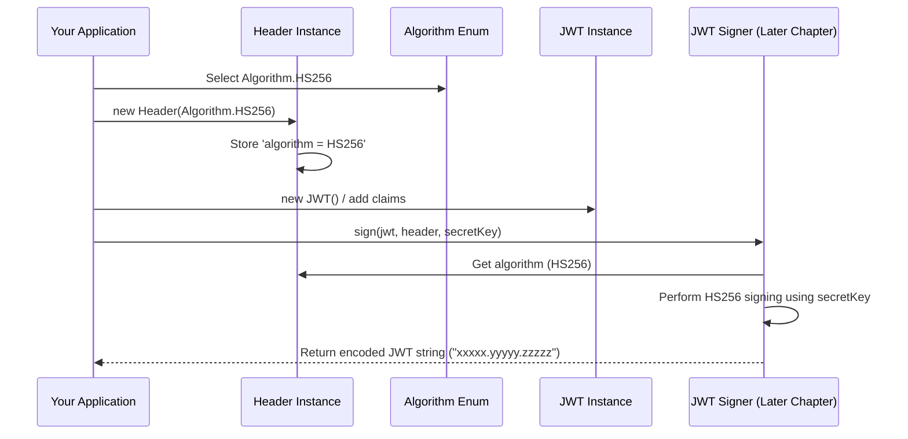

# Chapter 2: Algorithm Enum

In the [previous chapter](01_jwt__json_web_token__object_.md), we learned about the `JWT` object – our digital passport holding claims. But a passport isn't very trustworthy without security features to prevent forgery, right? Similarly, a JWT needs to be "sealed" or "signed" to ensure it hasn't been tampered with and that it really comes from who it says it comes from.

How do we specify *which* security method to use? That's where the `Algorithm` enum comes in.

## What's the Lock for Our Digital Passport?

Imagine you have a suitcase (your JWT data). You want to lock it before sending it. You have different types of locks available:

*   A simple combination lock (like using a shared secret password).
*   A key lock that needs a specific key to open (like using a private key to lock, and a public key to unlock).
*   Maybe even a more advanced fingerprint lock!

The **`Algorithm` enum** in our library is like the **catalog of locks** you can choose from for your JWT. It lists the standard, officially recognized methods for securing JWTs.

When you create a JWT, you need to choose one algorithm from this list and specify it in the JWT's **header**. This tells everyone else which "lock" you used, so they know how to "unlock" (verify) it later. The JWT header contains a special field called `alg` (short for algorithm) to store this choice.

## The Menu of Algorithms

The `Algorithm` enum provides a set of predefined constants representing the standard cryptographic algorithms supported by the JWT specification (and this library). Here are some of the most common ones:

*   **`HS256` (HMAC using SHA-256):** This is like the **combination lock**. It uses a single, shared secret key (like a password) known only to the sender and receiver. If you know the secret, you can both create and verify the signature. It's simple and efficient.
*   **`RS256` (RSA Signature with SHA-256):** This is like the **key lock**. It uses a pair of keys: a private key (kept secret by the sender) and a public key (which can be shared openly). The sender uses the private key to sign the JWT, and anyone with the public key can verify the signature. This is great when the verifier shouldn't be able to *create* tokens, only check them.
*   **`ES256` (ECDSA using P-256 curve and SHA-256):** This is another type of **key lock**, but it uses a different mathematical approach (Elliptic Curve Cryptography). It often results in shorter signatures and can be more efficient than RSA for the same security level. Like RSA, it uses a private key to sign and a public key to verify.
*   **`PS256` (RSA PSS Signature with SHA-256):** This is a more modern and often recommended variation of RSA signing that offers stronger security guarantees compared to `RS256`. It also uses a private/public key pair.
*   **`none`:** This explicitly means no signature or security is applied. This is **strongly discouraged** for any real application but is part of the specification.

Choosing the right algorithm depends on your security needs and system architecture (e.g., do you need public key verification?). For now, just know that `Algorithm` is where you make this choice.

## How to Specify the Algorithm

You typically specify the algorithm when you create the `Header` object for your JWT, *before* you sign it.

```java
import io.fusionauth.jwt.domain.Algorithm;
import io.fusionauth.jwt.domain.Header;
import io.fusionauth.jwt.domain.JWT;
import java.time.ZoneOffset;
import java.time.ZonedDateTime;

// 1. Choose an algorithm from the enum
Algorithm signingAlgorithm = Algorithm.HS256; // Let's use the 'combination lock'

// 2. Create the Header object, passing in the chosen algorithm
Header jwtHeader = new Header(signingAlgorithm);
jwtHeader.type = "JWT"; // Standard practice

// 3. Create the JWT payload (claims)
JWT jwt = new JWT()
    .setIssuer("https://myapp.example.com")
    .setSubject("user-abc")
    .setExpiration(ZonedDateTime.now(ZoneOffset.UTC).plusMinutes(30));

// 4. Associate the header with the JWT object
// (We don't directly set it here yet, but conceptually it belongs together.
// The Signer will use both later)

System.out.println("Chosen Algorithm: " + jwtHeader.algorithm);
System.out.println("JWT Header Type: " + jwtHeader.type);
```

**Explanation:**

1.  We import `Algorithm`, `Header`, and `JWT`.
2.  We select `Algorithm.HS256` from the enum.
3.  We create a new `Header` instance, passing our chosen algorithm to its constructor. The `Header` object now knows that this JWT is intended to be signed (or was signed) using `HS256`.
4.  We create the `JWT` object with its claims as we did in Chapter 1.
5.  Later, when we use a [JWTEncoder](06_jwtencoder_.md) to sign and create the final token string, it will look at the `algorithm` field in the `Header` to know *which* signing process to use. The `alg` claim in the final encoded JWT header will reflect this choice (e.g., `"alg": "HS256"`).

When someone receives the JWT string and wants to decode it using a [JWTDecoder](08_jwtdecoder_.md), the decoder will first peek inside the header part of the string, read the `alg` value, and use that information (along with the correct key) to select the appropriate verification method.

## Under the Hood: A Simple Enum

The `Algorithm` enum itself is quite straightforward. It's a standard Java `enum` where each value represents one of the allowed algorithms.



This diagram shows how the `Algorithm` chosen when creating the `Header` is later used by a signing component (like the [Signer Interface](05_signer_interface_.md) we'll cover later) to perform the correct cryptographic operation.

Let's peek at the `Algorithm.java` code:

```java
// From: main/java/io/fusionauth/jwt/domain/Algorithm.java

package io.fusionauth.jwt.domain;

/**
 * Available JSON Web Algorithms (JWA)...
 */
public enum Algorithm {
  // ECDSA Algorithms
  ES256("SHA256withECDSA"),
  ES384("SHA384withECDSA"),
  ES512("SHA512withECDSA"),

  // HMAC Algorithms
  HS256("HmacSHA256"), // Our example!
  HS384("HmacSHA384"),
  HS512("HmacSHA512"),

  // RSA PSS Algorithms
  PS256("SHA-256"), // Note: Java name differs for PSS
  PS384("SHA-384"),
  PS512("SHA-512"),

  // RSA PKCS#1 v1.5 Algorithms
  RS256("SHA256withRSA"), // Common RSA
  RS384("SHA384withRSA"),
  RS512("SHA512withRSA"),

  // None Algorithm
  none("None");

  // Internal field storing the name Java Security libraries understand
  public final String algorithm;

  Algorithm(String algorithm) {
    this.algorithm = algorithm;
  }

  // Finds the enum value based on the JWA name (e.g., "HS256")
  public static Algorithm fromName(String name) {
    // ... (loops through enum values) ...
     if (alg.name().equals(name)) { // Checks HS256, RS256 etc.
        return alg;
     }
    // ...
    return null;
  }

  // Gets the Java Security algorithm name (e.g., "HmacSHA256")
  public String getName() {
    return algorithm;
  }

  // ... (other helper methods like getSaltLength for PSS) ...
}
```

**Key Points from the Code:**

*   It's a standard `enum` definition.
*   Each enum constant (like `HS256`, `RS256`) represents a JWA standard algorithm name.
*   Each constant stores an associated `String` (like `"HmacSHA256"`, `"SHA256withRSA"`) which is the name recognized by Java's underlying cryptographic libraries (JCA - Java Cryptography Architecture). This is stored in the `algorithm` field.
*   The `fromName(String name)` method is crucial when *decoding* a JWT. It takes the `alg` value read from the token header (e.g., `"HS256"`) and finds the corresponding `Algorithm` enum constant.
*   The `getName()` method returns the internal Java algorithm name, used when interacting with the JCA for actual signing or verification.

The `Algorithm` enum acts as a safe and standardized bridge between the JWT world (using names like "HS256") and the Java cryptography world (using names like "HmacSHA256").

## Conclusion

You've now learned about the `Algorithm` enum – the menu of security methods for your JWTs.

*   It provides a **standardized list** of cryptographic algorithms (`HS256`, `RS256`, etc.).
*   You choose an algorithm and specify it in the JWT `Header` using the `alg` claim.
*   This choice dictates **how the JWT will be signed** (using a [Signer Interface](05_signer_interface_.md)) and **how it must be verified** (using a [Verifier Interface](07_verifier_interface_.md)).
*   Under the hood, it's a Java enum that maps JWT algorithm names to the names required by Java's security libraries.

Choosing the algorithm is the first step in securing your JWT. The next step often involves getting the actual keys needed for that algorithm. Some algorithms (like RS256, ES256, PS256) use keys that are often stored in a specific text-based format called PEM. Let's explore how to handle those next!

Next: [Chapter 3: PEM (Privacy-Enhanced Mail) Handling](03_pem__privacy_enhanced_mail__handling_.md)

---

Generated by [AI Codebase Knowledge Builder](https://github.com/The-Pocket/Tutorial-Codebase-Knowledge)