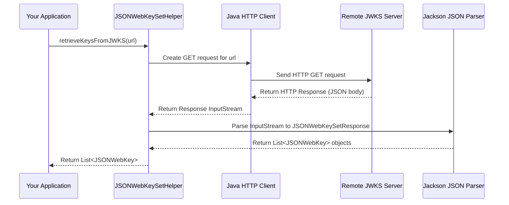
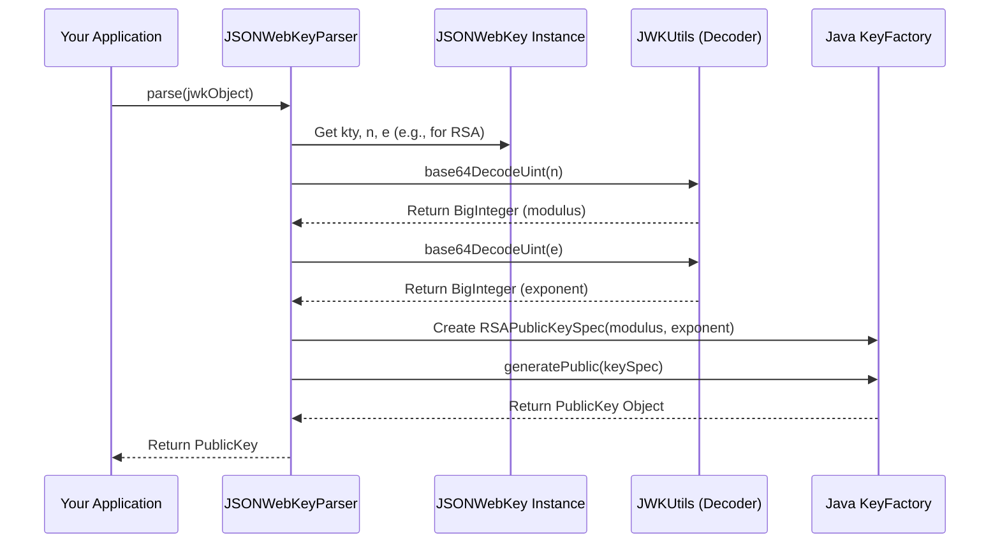

# Chapter 4: JSONWebKey (JWK) Handling

In the [previous chapter](03_pem__privacy_enhanced_mail__handling_.md), we learned how to handle cryptographic keys stored in the text-based PEM format, like reading a private key from a `.pem` file. That's great when you have the key files directly.

But what if you need to get a public key from a service running somewhere else on the internet? For example, imagine you're building a website that allows users to log in using their Google account. When Google sends you a JWT confirming the user's identity, your website needs Google's *public key* to verify that the JWT is authentic and really came from Google.

Google (and many other services) won't email you their public key PEM file! Instead, they publish their public keys online in a standard format called **JSON Web Key (JWK)**.

## The Public Phonebook for Keys: JWK and JWKS

Think of **JWK (JSON Web Key)** as a **standard business card format** for a cryptographic key, but written in JSON. It contains all the necessary details about the key, like what type it is (RSA, EC), what it can be used for (signing, encryption), and the actual key values (like the modulus and exponent for an RSA key).

Here's a simplified example of what a single RSA public key might look like in JWK format:

```json
{
  "kty": "RSA",
  "use": "sig",
  "kid": "unique-key-identifier-123",
  "n": "0vx7agoebGcQSuuPiLJXZptN9nndrQmbXEps2",
  "e": "AQAB",
  "alg": "RS256"
}
```

*   `kty`: Key Type (here, "RSA").
*   `use`: Intended Use (here, "sig" for signature verification).
*   `kid`: Key ID (a unique name for this key).
*   `n`, `e`: The actual RSA public key components (modulus and exponent, encoded in a special way).
*   `alg`: The algorithm this key is typically used with.

Now, a service often has *multiple* keys (maybe they're rotating keys for security). They publish these keys together in a list called a **JWK Set (JWKS)**. Think of a JWKS as a **public phonebook** where each entry is a JWK (a business card). This phonebook is usually available at a specific web address (URL), often called a **JWKS URI**.

Here's a simplified example of a JWKS containing two keys:

```json
{
  "keys": [
    {
      "kty": "RSA",
      "use": "sig",
      "kid": "key-id-1",
      "n": "...",
      "e": "AQAB",
      "alg": "RS256"
    },
    {
      "kty": "EC",
      "use": "sig",
      "kid": "key-id-2",
      "crv": "P-256",
      "x": "...",
      "y": "...",
      "alg": "ES256"
    }
  ]
}
```

The `fusionauth-jwt` library provides tools to work with these online "phonebooks" and "business cards":

1.  **`JSONWebKeySetHelper`:** Your robot assistant that goes to a web address (like a JWKS URI or an OpenID Connect discovery URL) and fetches the entire phonebook (JWK Set).
2.  **`JSONWebKey` object:** Represents a single JWK (a business card) in your Java code after it's been fetched or created.
3.  **`JSONWebKeyParser`:** A tool that reads the details from a `JSONWebKey` object (the business card) and gives you the actual Java `PublicKey` object you need for verification. (Analogous to `PEMDecoder`).
4.  **`JSONWebKeyBuilder`:** A tool that takes a Java key or certificate and creates a `JSONWebKey` object (formats it like a business card). (Analogous to `PEMEncoder`).

Our main use case: Fetching a public key from an online JWKS endpoint to verify a JWT.

## Fetching Keys from the Web (`JSONWebKeySetHelper`)

Let's say a service tells you their JWKS "phonebook" is located at `https://example.com/.well-known/jwks.json`. You can use `JSONWebKeySetHelper` to get all the keys listed there.

```java
import io.fusionauth.jwks.JSONWebKeySetHelper;
import io.fusionauth.jwks.domain.JSONWebKey;
import java.util.List;

try {
    // The URL where the JWK Set (phonebook) is published
    String jwksUri = "https://example.com/.well-known/jwks.json";

    // Use the helper to fetch the keys
    // This makes an HTTP GET request to the URL
    List<JSONWebKey> keys = JSONWebKeySetHelper.retrieveKeysFromJWKS(jwksUri);

    System.out.println("Successfully fetched " + keys.size() + " keys!");

    // Now you have a list of JSONWebKey objects
    for (JSONWebKey key : keys) {
        System.out.println(" - Key ID (kid): " + key.kid + ", Type (kty): " + key.kty);
    }

} catch (Exception e) {
    System.err.println("Error fetching JWKS: " + e.getMessage());
    // Handle network errors, parsing errors, etc.
}
```

**Explanation:**

1.  We import `JSONWebKeySetHelper` and `JSONWebKey`.
2.  We specify the URL (`jwksUri`) where the keys are published.
3.  `JSONWebKeySetHelper.retrieveKeysFromJWKS(jwksUri)` does the magic:
    *   It connects to the URL over the network (HTTP GET).
    *   It expects the response to be a JSON document formatted like the JWKS example above.
    *   It parses the JSON and converts each key entry in the `"keys"` array into a `JSONWebKey` object.
    *   It returns a `List<JSONWebKey>`.
4.  We can then iterate through the list. Each `JSONWebKey` object holds the properties from the JSON (`kid`, `kty`, `n`, `e`, etc.).

**(Self-Study Tip):** Many OpenID Connect providers (like Google, Okta, FusionAuth) publish a "discovery document" (often at `/.well-known/openid-configuration`). This document contains the URL of the JWKS endpoint. `JSONWebKeySetHelper` also has methods like `retrieveKeysFromIssuer` or `retrieveKeysFromWellKnownConfiguration` that can automatically find the JWKS URI from these discovery documents first, before fetching the keys.

## Getting a Usable Key (`JSONWebKeyParser`)

Okay, we fetched the list of `JSONWebKey` objects (the business cards). But for verifying a JWT signature, we need an actual `java.security.PublicKey` object. How do we get that from a `JSONWebKey`? We use `JSONWebKeyParser`.

Imagine you received a JWT that has a `"kid"` (Key ID) in its header, telling you which specific key was used to sign it. You can find the matching `JSONWebKey` from the list you fetched and then parse it.

```java
import io.fusionauth.jwks.JSONWebKeyParser;
import io.fusionauth.jwks.domain.JSONWebKey;
// Assume 'keys' is the List<JSONWebKey> from the previous example
// Assume 'jwtKid' is the Key ID from the JWT header we need to verify
import java.security.PublicKey;
import java.util.List;
import java.util.Optional;

String jwtKid = "key-id-1"; // The key ID we are looking for
List<JSONWebKey> keys = /* ... fetched list from previous step ... */;

// 1. Find the right JSONWebKey from the list using the kid
Optional<JSONWebKey> foundKey = keys.stream()
                                   .filter(key -> jwtKid.equals(key.kid))
                                   .findFirst();

if (foundKey.isPresent()) {
    JSONWebKey keyToParse = foundKey.get();
    System.out.println("Found matching key with kid: " + keyToParse.kid);

    // 2. Use JSONWebKeyParser to get the PublicKey
    JSONWebKeyParser parser = new JSONWebKeyParser();
    try {
        PublicKey publicKey = parser.parse(keyToParse);

        System.out.println("Successfully parsed PublicKey!");
        System.out.println(" - Algorithm: " + publicKey.getAlgorithm()); // e.g., RSA, EC
        // Now you can use this 'publicKey' with a Verifier!
        // E.g., Verifier verifier = Verifier.newInstance(publicKey);

    } catch (Exception e) {
        System.err.println("Error parsing JWK to PublicKey: " + e.getMessage());
    }
} else {
    System.err.println("Could not find key with kid: " + jwtKid);
}
```

**Explanation:**

1.  We first find the specific `JSONWebKey` object from our list whose `kid` matches the one specified in the JWT we want to verify. (Using Java Streams makes this easy).
2.  If we find a match, we create a `JSONWebKeyParser` instance.
3.  We call `parser.parse(keyToParse)`, passing in the `JSONWebKey` object.
4.  The `parse` method looks at the key's properties (`kty`, `n`, `e` for RSA; `kty`, `crv`, `x`, `y` for EC) and uses Java's security libraries to reconstruct the corresponding `java.security.PublicKey` object.
5.  This `PublicKey` is now ready to be used with a [Verifier Interface](07_verifier_interface_.md) to check the signature of the JWT.

## Creating a JWK (`JSONWebKeyBuilder`) - Optional

Sometimes, you might have a Java `PublicKey` or `PrivateKey` (maybe loaded from a [PEM file](03_pem__privacy_enhanced_mail__handling_.md) or generated) and want to represent it in the JWK JSON format, perhaps to publish your *own* JWKS endpoint. `JSONWebKeyBuilder` does this conversion.

```java
import io.fusionauth.jwks.JSONWebKeyBuilder;
import io.fusionauth.jwks.domain.JSONWebKey;
import java.security.PublicKey;
// Assume 'myPublicKey' is a java.security.PublicKey object we have
// For example, loaded using PEMDecoder from the previous chapter

PublicKey myPublicKey = /* ... obtained somehow ... */;
String myKeyId = "my-app-public-key-v1";

try {
    // Create a builder instance
    JSONWebKeyBuilder builder = new JSONWebKeyBuilder();

    // Build the JSONWebKey object from the PublicKey
    JSONWebKey jwk = builder.build(myPublicKey);

    // We can set additional JWK parameters if needed
    jwk.kid = myKeyId;
    jwk.use = "sig"; // For signature verification
    // 'alg' might be set automatically based on key type/size

    System.out.println("Built JSONWebKey object:");
    System.out.println(jwk.toJSON()); // Convert JWK object to JSON string

} catch (Exception e) {
    System.err.println("Error building JWK: " + e.getMessage());
}
```

**Explanation:**

1.  We get hold of a Java `PublicKey` object.
2.  We create a `JSONWebKeyBuilder`.
3.  We call `builder.build(myPublicKey)`. This inspects the `PublicKey` object, extracts its components (like modulus `n` and exponent `e` for RSA), encodes them correctly (Base64URL), and populates a new `JSONWebKey` object.
4.  We can then set other standard JWK fields like `kid` (Key ID) and `use` (intended usage).
5.  The `jwk.toJSON()` method provides a convenient way to serialize the `JSONWebKey` object into a JSON string, ready to be included in a JWKS file or API response.

## Under the Hood: How JWK Handling Works

Let's quickly peek at what happens inside these components.

### `JSONWebKeySetHelper` (Fetching)

When you call `JSONWebKeySetHelper.retrieveKeysFromJWKS(jwksUri)`:

1.  **Build Connection:** It creates a standard Java `HttpURLConnection` for the given `jwksUri`.
2.  **HTTP GET:** It makes an HTTP GET request to the URL. (You can customize the connection, e.g., set timeouts or headers, using overloaded methods).
3.  **Read Response:** It reads the response body from the connection.
4.  **Parse JSON:** It uses an internal JSON library (Jackson) to parse the response body, expecting a JSON object with a `"keys"` array.
5.  **Map to Objects:** It maps each JSON object inside the `"keys"` array into an instance of the `io.fusionauth.jwks.domain.JSONWebKey` class.
6.  **Return List:** It returns the resulting `List<JSONWebKey>`.



The code in `JSONWebKeySetHelper.java` reflects this flow, using helper methods for HTTP requests and Jackson for deserialization.

### `JSONWebKeyParser` (Parsing JWK to Java Key)

When you call `parser.parse(jsonWebKey)`:

1.  **Check Key Type:** It looks at the `jsonWebKey.kty` field (e.g., "RSA", "EC").
2.  **Extract Components:** Based on the type, it reads the required component strings (e.g., `n` and `e` for RSA; `crv`, `x`, `y` for EC).
3.  **Decode Components:** It uses `JWKUtils.base64DecodeUint` to decode these Base64URL-encoded strings back into `BigInteger` objects (the mathematical representation of the key parts). This decoding handles the specific format required by JWK (unsigned integers, URL-safe Base64).
4.  **Create KeySpec:** It creates a standard Java "Key Specification" object (e.g., `RSAPublicKeySpec` or `ECPublicKeySpec`) using the decoded `BigInteger` components. For EC keys, it also determines the correct curve parameters based on the `crv` field.
5.  **Use KeyFactory:** It gets an instance of `java.security.KeyFactory` for the appropriate algorithm ("RSA" or "EC").
6.  **Generate Key:** It calls `keyFactory.generatePublic(keySpec)` to create the actual `java.security.PublicKey` object.
7.  **(Optional) Verify x5c:** If the JWK includes an `x5c` (certificate chain) field, the parser might optionally decode the certificate and verify that the public key inside it matches the components (`n`, `e` or `x`, `y`) provided directly in the JWK, as a consistency check (see `verifyX5cRSA`/`verifyX5cEC` in `JSONWebKeyParser.java`).
8.  **Return Key:** It returns the generated `PublicKey`.



The core logic resides in `JSONWebKeyParser.java`, leveraging `JWKUtils.java` for the specific JWK decoding rules and standard Java Security classes (`KeyFactory`, `RSAPublicKeySpec`, etc.).

### `JSONWebKeyBuilder` (Building JWK from Java Key)

When you call `builder.build(publicKey)`:

1.  **Check Key Type:** It determines the algorithm of the input `PublicKey` ("RSA" or "EC").
2.  **Extract Components:** It casts the key to its specific type (e.g., `RSAPublicKey`) and accesses its components (e.g., `getModulus()`, `getPublicExponent()`).
3.  **Encode Components:** It uses `JWKUtils.base64EncodeUint` to convert these components (`BigInteger`s) into the Base64URL-encoded strings required by the JWK standard.
4.  **Populate JWK Object:** It creates a new `JSONWebKey` object and sets the appropriate fields (`kty`, `n`, `e`, etc.) with the encoded string values. It might also infer other fields like `alg` or `crv` based on the key properties.
5.  **Return JWK:** It returns the populated `JSONWebKey` object.

This process is implemented in `JSONWebKeyBuilder.java`, again using `JWKUtils.java` for encoding.

## Conclusion

Congratulations! You've learned about JSON Web Keys (JWK) and JWK Sets (JWKS), the standard JSON formats for representing cryptographic keys, especially for online discovery.

*   You understand that **JWK** is like a **digital business card** for a key, and **JWKS** is like a **public phonebook** (often found at a JWKS URI) listing multiple keys.
*   You know how to use `JSONWebKeySetHelper` to **fetch** a JWKS phonebook from a web URL.
*   You learned how to use `JSONWebKeyParser` to read a `JSONWebKey` business card and get a usable Java `PublicKey` object needed for verification.
*   You saw how `JSONWebKeyBuilder` can create a `JSONWebKey` object from a Java key.

This ability to fetch and parse keys published online is crucial when you need to verify JWTs issued by external services. The `PublicKey` obtained via `JSONWebKeyParser` is exactly what you need for the verification step.

Now that we understand JWTs, algorithms, and how to handle keys in both PEM and JWK formats, we need to look at how to actually *use* these keys to create and verify the secure signatures on JWTs. This involves the concepts of Signers and Verifiers.

Next: [Chapter 5: Signer Interface](05_signer_interface_.md)

---

Generated by [AI Codebase Knowledge Builder](https://github.com/The-Pocket/Tutorial-Codebase-Knowledge)