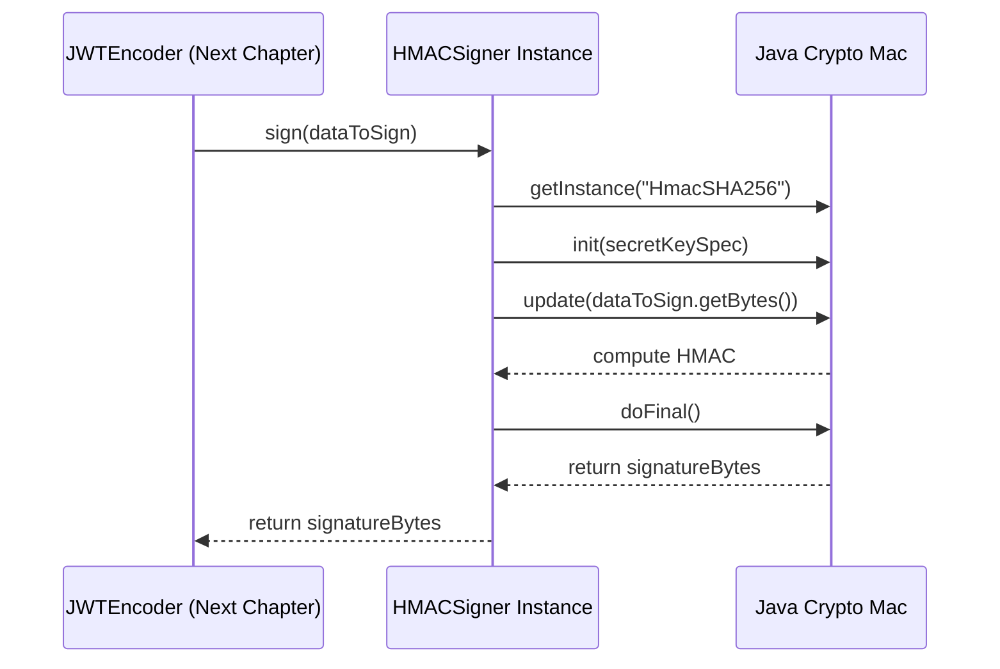

# Chapter 5: Signer Interface

In the [previous chapter](04_jsonwebkey__jwk__handling_.md), we learned how to get cryptographic keys, either from local PEM files or from online JWK "phonebooks". We now have:

1.  Our [JWT (JSON Web Token) Object](01_jwt__json_web_token__object_.md) containing the claims (the passport information).
2.  Knowledge of the [Algorithm Enum](02_algorithm_enum_.md) to choose our security method (the type of lock).
3.  Ways to get the keys needed for those algorithms ([PEM Handling](03_pem__privacy_enhanced_mail__handling_.md) and [JWK Handling](04_jsonwebkey__jwk__handling_.md)).

But how do we actually *apply* the lock? We need a tool, a specialized machine, that takes our chosen key and algorithm and physically creates the security seal on our JWT passport. This is where the `Signer` interface comes in.

## The Official Sealing Machine: What is the `Signer` Interface?

Imagine you have your completed passport application ([JWT Object](01_jwt__json_web_token__object_.md)) and the official seal stamp (your secret key or private key). You need to go to an authorized machine or official to apply that seal correctly.

The **`Signer` interface** is like the **design specification** for that official sealing machine. It defines the **contract** – the rules and requirements – that any "sealing machine" must follow to be considered valid for signing JWTs in this library.

It doesn't perform the sealing itself; it just says, "Any valid JWT signer *must* be able to do these things":

1.  Tell us which [Algorithm](02_algorithm_enum_.md) it uses (e.g., `HS256`, `RS256`).
2.  Optionally, tell us its Key ID (`kid`) if it has one.
3.  Take the part of the JWT that needs signing (the header and payload combined) and produce the actual digital signature (the seal) as raw bytes.

Different algorithms require different types of "machines" (different implementations of the `Signer` interface):

*   An `HMACSigner` uses a shared secret key (like a password).
*   An `RSASigner` uses an RSA private key (like a unique physical stamp).
*   An `ECSigner` uses an Elliptic Curve private key (another type of unique stamp).
*   An `RSAPSSSigner` uses an RSA private key with a different signing scheme (PSS).
*   An `UnsecuredSigner` is like a machine that applies no seal at all (`alg: "none"`) – **use with extreme caution, usually never!**

The main job of a `Signer` implementation is to take the data to be signed and the *correct* key/secret, perform the cryptographic calculation according to its specific [Algorithm](02_algorithm_enum_.md), and output the resulting signature bytes.

## Getting Your Signing Machine Ready

You don't usually create a `Signer` object directly using `new`. Instead, the library provides convenient factory methods to get the right `Signer` for your chosen algorithm and key.

**Use Case:** Let's prepare two different "signing machines": one for HMAC (shared secret) and one for RSA (private key).

**Example 1: Getting an HMAC Signer (`HS256`)**

HMAC algorithms use a simple shared secret string or byte array.

```java
import io.fusionauth.jwt.hmac.HMACSigner;
import io.fusionauth.jwt.Signer;
import io.fusionauth.jwt.domain.Algorithm;

// Your secret password (keep this safe!)
String sharedSecret = "my-super-secret-password-that-is-long-enough";
String keyId = "hmac-key-01"; // Optional identifier for this key

// Get the Signer "machine" for HS256 using the secret
Signer hmacSigner = HMACSigner.newSHA256Signer(sharedSecret, keyId);

System.out.println("Created Signer for Algorithm: " + hmacSigner.getAlgorithm());
System.out.println("Signer Key ID (kid): " + hmacSigner.getKid());
// Output:
// Created Signer for Algorithm: HS256
// Signer Key ID (kid): hmac-key-01
```

**Explanation:**

1.  We import `HMACSigner`, `Signer`, and `Algorithm`.
2.  We define our `sharedSecret`. **Important:** In real applications, manage secrets securely, don't hardcode them!
3.  We use `HMACSigner.newSHA256Signer(sharedSecret, keyId)` to get an instance of `Signer`. This specific implementation (`HMACSigner`) knows how to perform `HS256` signing using the secret we provided.
4.  We can verify it's configured for the correct algorithm (`HS256`) and holds the Key ID.

**Example 2: Getting an RSA Signer (`RS256`)**

RSA algorithms use a private key, which we might load from a PEM file (as seen in [Chapter 3](03_pem__privacy_enhanced_mail__handling_.md)).

```java
import io.fusionauth.jwt.rsa.RSASigner;
import io.fusionauth.jwt.Signer;
import io.fusionauth.jwt.domain.Algorithm;
import io.fusionauth.pem.PEMDecoder; // From Chapter 3
import java.nio.file.Files;
import java.nio.file.Paths;
import java.security.PrivateKey;

try {
    // Assume 'my_private_key.pem' exists from Chapter 3 examples
    // 1. Load the private key using PEMDecoder
    String privateKeyPEM = new String(Files.readAllBytes(Paths.get("my_private_key.pem")));
    PEMDecoder decoder = new PEMDecoder();
    PrivateKey rsaPrivateKey = decoder.decode(privateKeyPEM).getPrivateKey();

    String keyId = "rsa-key-123"; // Optional identifier

    // 2. Get the Signer "machine" for RS256 using the private key
    Signer rsaSigner = RSASigner.newSHA256Signer(rsaPrivateKey, keyId);

    System.out.println("Created Signer for Algorithm: " + rsaSigner.getAlgorithm());
    System.out.println("Signer Key ID (kid): " + rsaSigner.getKid());
    // Output:
    // Created Signer for Algorithm: RS256
    // Signer Key ID (kid): rsa-key-123

} catch (Exception e) {
    System.err.println("Error creating RSA Signer: " + e.getMessage());
}
```

**Explanation:**

1.  We import the necessary classes, including `RSASigner` and `PEMDecoder`.
2.  We first load the `PrivateKey` object from a PEM file string using the `PEMDecoder` we learned about.
3.  We use `RSASigner.newSHA256Signer(rsaPrivateKey, keyId)` to get the `Signer` implementation specifically for `RS256`. This `RSASigner` object holds onto our private key internally, ready to use it.
4.  We confirm the algorithm (`RS256`) and Key ID.

Now we have `hmacSigner` and `rsaSigner` objects, ready to perform their respective signing tasks. The actual process of combining the JWT data, using the `Signer` to generate the signature, and producing the final `xxxxx.yyyyy.zzzzz` string is handled by the [JWTEncoder](06_jwtencoder_.md), which we'll see in the next chapter. The `Signer`'s role is purely to generate the `zzzzz` part (the signature bytes).

## Under the Hood: The `Signer` Interface and Its Implementations

Let's look at the blueprint (`Signer.java`) and then a simplified view of how a specific machine (`HMACSigner.java`) works.

**1. The Blueprint: `Signer.java`**

This interface defines the essential methods any signer must provide.

```java
// From: main/java/io/fusionauth/jwt/Signer.java
package io.fusionauth.jwt;

import io.fusionauth.jwt.domain.Algorithm;

// The contract for all JWT signing operations
public interface Signer {

  /**
   * Tells which algorithm this Signer uses.
   * @return the algorithm enum value (e.g., Algorithm.HS256).
   */
  Algorithm getAlgorithm();

  /**
   * Returns the Key ID (kid) associated with this signer, if any.
   * This helps the verifier find the correct public key.
   * @return the kid string, or throws UnsupportedOperationException if not set.
   */
  default String getKid() {
    throw new UnsupportedOperationException();
  }

  /**
   * Performs the actual signing operation.
   * @param payload The string data to sign (typically Base64URL(header) + "." + Base64URL(payload)).
   * @return The raw signature bytes.
   */
  byte[] sign(String payload);
}
```

**Key Points:**

*   It's a simple interface.
*   `getAlgorithm()` is crucial for the [JWTEncoder](06_jwtencoder_.md) to set the correct `alg` value in the JWT header.
*   `getKid()` is used by the [JWTEncoder](06_jwtencoder_.md) to set the `kid` header, if available.
*   `sign(String payload)` is the core method that does the cryptographic work. It takes the data to be signed and returns the raw signature bytes.

**2. A Concrete Machine: `HMACSigner.java` (Simplified View)**

This class implements the `Signer` interface for HMAC algorithms (`HS256`, `HS384`, `HS512`).

*   **Internal State:** When created (e.g., via `HMACSigner.newSHA256Signer`), it stores the chosen `Algorithm` (`HS256`), the `secret` byte array, and the optional `kid`.
*   **`sign` Method:** When `sign(payload)` is called:
    1.  It gets an instance of Java's `javax.crypto.Mac` class, configured for the specific HMAC algorithm (e.g., `"HmacSHA256"` from `algorithm.getName()`).
    2.  It initializes the `Mac` object with the stored `secret` bytes, creating a `SecretKeySpec`.
    3.  It feeds the input `payload` string (converted to bytes) into the initialized `Mac`.
    4.  It calls `mac.doFinal()` to compute the HMAC signature.
    5.  It returns the resulting signature bytes.



Here's a highly simplified conceptual look at the code:

```java
// Simplified conceptual code for: main/java/io/fusionauth/jwt/hmac/HMACSigner.java
public class HMACSigner implements Signer {
    private final Algorithm algorithm; // e.g., HS256
    private final byte[] secret;      // The shared secret key
    private final String kid;         // Optional Key ID
    // CryptoProvider helps get the Mac instance (omitted for simplicity)

    // Constructor called by factory methods like newSHA256Signer(...)
    private HMACSigner(Algorithm algorithm, byte[] secret, String kid /*...*/) {
        this.algorithm = algorithm;
        this.secret = secret;
        this.kid = kid;
        // ... null checks ...
    }

    @Override
    public Algorithm getAlgorithm() {
        return algorithm;
    }

    @Override
    public String getKid() {
        return kid; // May be null if not provided
    }

    @Override
    public byte[] sign(String message) {
        try {
            // 1. Get Mac instance for the algorithm (e.g., "HmacSHA256")
            Mac mac = Mac.getInstance(algorithm.getName());

            // 2. Initialize with the secret key
            SecretKeySpec secretKeySpec = new SecretKeySpec(secret, algorithm.getName());
            mac.init(secretKeySpec);

            // 3. Process the input message
            byte[] messageBytes = message.getBytes(StandardCharsets.UTF_8);

            // 4. Compute the signature
            byte[] signatureBytes = mac.doFinal(messageBytes);

            // 5. Return the result
            return signatureBytes;

        } catch (NoSuchAlgorithmException | InvalidKeyException e) {
            // Handle errors properly
            throw new JWTSigningException("Failed to sign JWT", e);
        }
    }
}
```

**3. Other Signer Implementations**

*   **`RSASigner.java` / `RSAPSSSigner.java` / `ECSigner.java`:** These work similarly but use the `java.security.Signature` class from Java's Cryptography Architecture (JCA). They are initialized with the corresponding `PrivateKey` (loaded via [PEM Handling](03_pem__privacy_enhanced_mail__handling_.md) or other means) and perform the signing according to their specific algorithm (`RS256`, `PS256`, `ES256`, etc.). The `ECSigner` also includes extra logic to convert the standard DER-encoded signature from JCA into the fixed-length format required by JWTs.
*   **`UnsecuredSigner.java`:** This is a trivial implementation for `Algorithm.none`. Its `sign` method simply returns an empty byte array.

## Conclusion

You've now learned about the `Signer` interface – the blueprint for the "official sealing machine" in our JWT library.

*   It defines the **contract** for how JWT signing should be performed.
*   Specific implementations like `HMACSigner`, `RSASigner`, `ECSigner`, and `RSAPSSSigner` handle different algorithms ([Algorithm Enum](02_algorithm_enum_.md)) using the appropriate secrets or private keys ([PEM Handling](03_pem__privacy_enhanced_mail__handling_.md)).
*   You obtain a `Signer` instance using factory methods (e.g., `HMACSigner.newSHA256Signer(...)`).
*   The `Signer`'s main job is to take the data to be signed and produce the raw **signature bytes** using its configured key and algorithm.

The `Signer` is a crucial component, but it only produces the signature part. How do we combine the header, payload, and this signature into the final, compact `xxxxx.yyyyy.zzzzz` JWT string? That's the job of the `JWTEncoder`.

Next: [Chapter 6: JWTEncoder](06_jwtencoder_.md)

---

Generated by [AI Codebase Knowledge Builder](https://github.com/The-Pocket/Tutorial-Codebase-Knowledge)