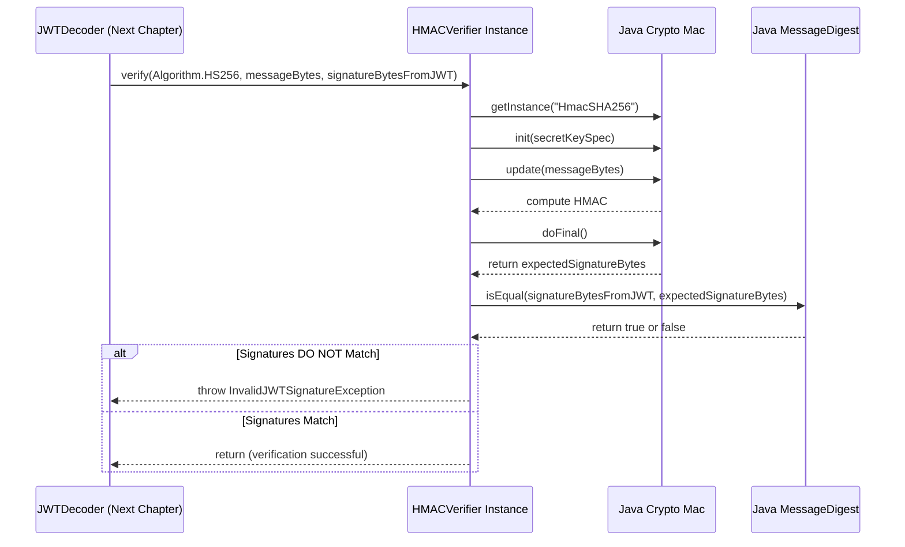

# Chapter 7: Verifier Interface

In the [previous chapter](06_jwtencoder_.md), we learned how the [JWTEncoder](06_jwtencoder_.md) acts like a lamination machine, taking our passport data ([JWT (JSON Web Token) Object](01_jwt__json_web_token__object_.md)) and a sealing tool ([Signer Interface](05_signer_interface_.md)) to produce the final, signed JWT string (`xxxxx.yyyyy.zzzzz`). We can now securely create and send these digital passports!

But what happens when *we* are the ones *receiving* a JWT? Imagine your application receives a JWT from another service. How can you be sure that:

1.  It really came from the service it claims to be from?
2.  Nobody tampered with the information (the claims) inside it after it was created?

We need a way to check the security seal. This is where the `Verifier` interface comes in.

## The Border Control Officer: What is the `Verifier` Interface?

Think of the **`Verifier` interface** as the **design specification** for a **border control officer**. Their job is to inspect an incoming passport (the JWT) and meticulously check its security features (the signature) to ensure it's authentic and hasn't been forged or altered.

Just like the [Signer Interface](05_signer_interface_.md) defined the contract for *creating* the seal, the `Verifier` interface defines the contract for *checking* the seal. It specifies what any valid signature-checking tool must be able to do:

1.  **Declare Capability:** Tell us which [Algorithm](02_algorithm_enum_.md) types it can handle (e.g., "I can check HMAC seals", "I can check RSA seals").
2.  **Perform Verification:** Take the alleged algorithm, the signed parts of the JWT (header and payload), and the provided signature, then use the *correct* key (a shared secret or a public key) to determine if the signature is valid for that data. If the check fails, it must signal an error (throw an exception).

Different algorithms need different "officers" (different implementations of the `Verifier` interface):

*   An `HMACVerifier` uses the **same shared secret key** that was used for signing (like knowing the combination to check the lock).
*   An `RSAVerifier` uses the **public key** corresponding to the private key that signed the token (like having a special lens to check the unique stamp made by the private key).
*   An `ECVerifier` uses an **Elliptic Curve public key**.
*   An `RSAPSSVerifier` uses an **RSA public key** but checks the more modern PSS signature scheme.

The `Verifier` doesn't care about the *content* of the claims (like whether the token has expired – that's checked later). Its *sole focus* is: **Is this signature mathematically correct for this data, given the expected algorithm and key?**

## Getting Your Verification Tool Ready

Similar to `Signer`s, you get `Verifier` instances using convenient factory methods provided by the library. You need to provide the key material necessary for the specific algorithm.

**Use Case:** Let's prepare two "border officers": one for checking HMAC (`HS256`) signatures and one for checking RSA (`RS256`) signatures.

**Example 1: Getting an HMAC Verifier (`HS256`)**

To verify an HMAC signature, you need the *exact same secret* that was used to sign it.

```java
import io.fusionauth.jwt.Verifier;
import io.fusionauth.jwt.hmac.HMACVerifier;
import io.fusionauth.jwt.domain.Algorithm;

// The SAME secret used by the Signer
String sharedSecret = "my-super-secret-password-that-is-long-enough";

// Get the Verifier "officer" for HMAC algorithms using the secret
Verifier hmacVerifier = HMACVerifier.newVerifier(sharedSecret);

// Check if this verifier can handle HS256 (it should!)
boolean canVerifyHS256 = hmacVerifier.canVerify(Algorithm.HS256);

System.out.println("Created HMAC Verifier.");
System.out.println("Can it verify HS256? " + canVerifyHS256);
// Output:
// Created HMAC Verifier.
// Can it verify HS256? true
```

**Explanation:**

1.  We import `Verifier`, `HMACVerifier`, and `Algorithm`.
2.  We define the `sharedSecret`. This **must** match the secret used by the `HMACSigner` that created the JWT.
3.  We use `HMACVerifier.newVerifier(sharedSecret)` to get our `Verifier`. This specific implementation (`HMACVerifier`) knows how to check `HS256`, `HS384`, and `HS512` signatures using the secret we provided.
4.  The `canVerify` method confirms if this verifier instance supports a specific algorithm.

**Example 2: Getting an RSA Verifier (`RS256`)**

To verify an RSA signature, you need the **public key** that corresponds to the private key used for signing. You might get this from a PEM file ([Chapter 3](03_pem__privacy_enhanced_mail__handling_.md)) or a JWK endpoint ([Chapter 4](04_jsonwebkey__jwk__handling_.md)).

```java
import io.fusionauth.jwt.Verifier;
import io.fusionauth.jwt.rsa.RSAVerifier;
import io.fusionauth.jwt.domain.Algorithm;
import io.fusionauth.pem.PEMDecoder; // From Chapter 3
import java.nio.file.Files;
import java.nio.file.Paths;
import java.security.PublicKey;

try {
    // Assume 'my_public_key.pem' exists (counterpart to the private key)
    // 1. Load the public key using PEMDecoder
    String publicKeyPEM = new String(Files.readAllBytes(Paths.get("my_public_key.pem")));
    PEMDecoder decoder = new PEMDecoder();
    PublicKey rsaPublicKey = decoder.decode(publicKeyPEM).getPublicKey();

    // 2. Get the Verifier "officer" for RSA algorithms using the public key
    Verifier rsaVerifier = RSAVerifier.newVerifier(rsaPublicKey);

    System.out.println("Created RSA Verifier.");
    System.out.println("Can it verify RS256? " + rsaVerifier.canVerify(Algorithm.RS256));
    System.out.println("Can it verify ES256? " + rsaVerifier.canVerify(Algorithm.ES256));
    // Output:
    // Created RSA Verifier.
    // Can it verify RS256? true
    // Can it verify ES256? false

} catch (Exception e) {
    System.err.println("Error creating RSA Verifier: " + e.getMessage());
}
```

**Explanation:**

1.  We import the necessary classes, including `RSAVerifier` and `PEMDecoder`.
2.  We load the `PublicKey` object from its PEM representation. **Important:** This public key must mathematically match the private key used by the `RSASigner`.
3.  We use `RSAVerifier.newVerifier(rsaPublicKey)` to get the `Verifier` implementation for standard RSA algorithms (`RS256`, `RS384`, `RS512`). This `RSAVerifier` holds onto the public key.
4.  We check `canVerify`. Notice it correctly reports `true` for `RS256` but `false` for `ES256` (Elliptic Curve), as this specific verifier only handles RSA.

Now we have `hmacVerifier` and `rsaVerifier` objects, ready to check incoming JWT signatures. The actual process of parsing a JWT string, finding the right `Verifier`, and using it to check the signature is handled by the [JWTDecoder](08_jwtdecoder_.md) (Chapter 8). The `Verifier`'s role is just the core signature check.

## How Verification Works (Conceptual)

When a `Verifier` is asked to check a signature, here's the basic idea:

1.  **Receive Inputs:** It gets the `Algorithm` specified in the JWT header, the original signed data (which is `Base64Url(header) + "." + Base64Url(payload)`), and the signature provided in the JWT (`Base64Url(signature)`).
2.  **Decode Signature:** It decodes the Base64Url signature from the JWT back into raw signature bytes.
3.  **Perform Crypto Check:** This is the crucial part, and it depends on the algorithm:
    *   **HMAC (e.g., `HS256`):** It re-calculates the signature on the `signed data` using the *same shared secret* and the *same HMAC algorithm*.
    *   **RSA/EC/PSS (e.g., `RS256`):** It uses the *public key* and the specified algorithm (e.g., `SHA256withRSA`) to perform a cryptographic verification operation on the `signed data` and the `decoded signature bytes`. This operation essentially checks if the signature could only have been produced by the corresponding private key.
4.  **Compare Results:**
    *   **HMAC:** It compares the *re-calculated* signature bytes with the *decoded signature bytes* from the JWT. They must match exactly.
    *   **RSA/EC/PSS:** The verification operation directly returns `true` or `false`.
5.  **Outcome:** If the comparison passes (HMAC) or the verification returns `true` (RSA/EC/PSS), the signature is valid! If not, the `Verifier` throws an `InvalidJWTSignatureException` (or similar error) to signal that the token is invalid or has been tampered with.

## Under the Hood: The `Verifier` Interface and Its Implementations

Let's look at the blueprint (`Verifier.java`) and a simplified view of how a specific officer (`HMACVerifier.java`) works.

**1. The Blueprint: `Verifier.java`**

This interface defines the methods needed for verification.

```java
// From: main/java/io/fusionauth/jwt/Verifier.java
package io.fusionauth.jwt;

import io.fusionauth.jwt.domain.Algorithm;

// The contract for all JWT signature verification operations
public interface Verifier {

  /**
   * Checks if this Verifier can handle the specified algorithm.
   * @param algorithm The algorithm from the JWT header.
   * @return True if verification is possible, false otherwise.
   */
  boolean canVerify(Algorithm algorithm);

  /**
   * Performs the actual signature verification.
   *
   * @param algorithm The algorithm used (e.g., Algorithm.HS256).
   * @param message   The signed message bytes (Base64URL(header) + "." + Base64URL(payload)).
   *                  (Note: The library decodes this before passing to the Verifier)
   * @param signature The signature bytes from the JWT to be verified.
   *                  (Note: The library decodes this before passing to the Verifier)
   * @throws InvalidJWTSignatureException If the signature is invalid.
   * @throws JWTVerifierException If some other crypto error occurs.
   */
  void verify(Algorithm algorithm, byte[] message, byte[] signature);
}
```

**Key Points:**

*   `canVerify(Algorithm algorithm)`: Allows the [JWTDecoder](08_jwtdecoder_.md) to quickly check if a given `Verifier` is suitable for the `alg` found in the JWT header.
*   `verify(Algorithm algorithm, byte[] message, byte[] signature)`: The core method that performs the cryptographic check. It doesn't return anything; it only throws an exception if the verification *fails*. (The `message` and `signature` passed here are already decoded from Base64Url by the `JWTDecoder`).

**2. A Concrete Officer: `HMACVerifier.java` (Simplified View)**

This class implements the `Verifier` interface for HMAC algorithms.

*   **Internal State:** When created (e.g., via `HMACVerifier.newVerifier`), it stores the `secret` byte array.
*   **`verify` Method:** When `verify(algorithm, message, signature)` is called:
    1.  It gets an instance of Java's `javax.crypto.Mac` class, configured for the specific HMAC algorithm (e.g., `"HmacSHA256"`).
    2.  It initializes the `Mac` object with the stored `secret` bytes.
    3.  It feeds the input `message` bytes into the initialized `Mac`.
    4.  It calls `mac.doFinal()` to compute the *expected* signature based on the secret and the message.
    5.  It uses `java.security.MessageDigest.isEqual()` to perform a **constant-time comparison** between the *expected* signature bytes it just calculated and the `signature` bytes provided from the JWT. (Constant-time comparison prevents timing attacks).
    6.  If `isEqual` returns `false`, it throws `InvalidJWTSignatureException`. If it returns `true`, the method completes normally (signature is valid).



Here's a highly simplified conceptual look at the code:

```java
// Simplified conceptual code for: main/java/io/fusionauth/jwt/hmac/HMACVerifier.java
public class HMACVerifier implements Verifier {
    private final byte[] secret; // The shared secret key

    // Constructor called by factory methods like newVerifier(...)
    private HMACVerifier(byte[] secret /*...*/) {
        this.secret = secret;
        // ... null checks ...
    }

    @Override
    public boolean canVerify(Algorithm algorithm) {
        // Checks if algorithm is HS256, HS384, or HS512
        return algorithm == Algorithm.HS256 || algorithm == Algorithm.HS384 || algorithm == Algorithm.HS512;
    }

    @Override
    public void verify(Algorithm algorithm, byte[] message, byte[] signature) {
        try {
            // 1. Get Mac instance (e.g., "HmacSHA256")
            Mac mac = Mac.getInstance(algorithm.getName());

            // 2. Initialize with the secret key
            SecretKeySpec secretKeySpec = new SecretKeySpec(secret, algorithm.getName());
            mac.init(secretKeySpec);

            // 3. & 4. Calculate the expected signature
            byte[] actualSignature = mac.doFinal(message);

            // 5. Compare expected vs provided (constant time)
            if (!MessageDigest.isEqual(signature, actualSignature)) {
                // 6. Throw exception if mismatch
                throw new InvalidJWTSignatureException();
            }
            // If no exception, verification passed!

        } catch (NoSuchAlgorithmException | InvalidKeyException e) {
            throw new JWTVerifierException("Verification failed", e);
        }
    }
}
```

**3. Other Verifier Implementations**

*   **`RSAVerifier.java` / `RSAPSSVerifier.java` / `ECVerifier.java`:** These work similarly but use the `java.security.Signature` class.
    *   They are initialized with the corresponding `PublicKey` (loaded via [PEM Handling](03_pem__privacy_enhanced_mail__handling_.md), [JWK Handling](04_jsonwebkey__jwk__handling_.md), or other means).
    *   In the `verify` method, they call `signature.initVerify(publicKey)`, then `signature.update(message)`, and finally `signature.verify(signatureBytesFromJWT)`.
    *   The `verify` method of `java.security.Signature` returns a boolean. If it's `false`, these Verifiers throw `InvalidJWTSignatureException`.
    *   `ECVerifier` includes extra logic to handle the conversion between the JWT's fixed-length EC signature format and the DER format expected by Java's `Signature.verify`. It also includes a check against a known vulnerability (CVE-2022-21449).

## Conclusion

You've now met the `Verifier` interface – the contract for our "border control officers" who check the authenticity of JWTs.

*   It defines the **contract** for how JWT signature verification must be performed.
*   Specific implementations like `HMACVerifier`, `RSAVerifier`, `ECVerifier`, and `RSAPSSVerifier` handle different algorithms ([Algorithm Enum](02_algorithm_enum_.md)) using the appropriate secrets or **public keys** ([PEM Handling](03_pem__privacy_enhanced_mail__handling_.md), [JWK Handling](04_jsonwebkey__jwk__handling_.md)).
*   You obtain a `Verifier` instance using factory methods (e.g., `HMACVerifier.newVerifier(...)`, `RSAVerifier.newVerifier(...)`).
*   The `Verifier`'s main job is to take the signed data and the signature from a JWT and use the correct key to **cryptographically confirm** if the signature is valid. It throws an exception if the check fails.

The `Verifier` is essential for trusting the JWTs you receive. But just checking the signature isn't the whole story. We also need to parse the JWT string, decode its parts, figure out which `Verifier` to use, *then* perform the signature check, and *finally* give us back the claims from the payload if everything is okay. This complete process is handled by the `JWTDecoder`.

Next: [Chapter 8: JWTDecoder](08_jwtdecoder_.md)

---

Generated by [AI Codebase Knowledge Builder](https://github.com/The-Pocket/Tutorial-Codebase-Knowledge)