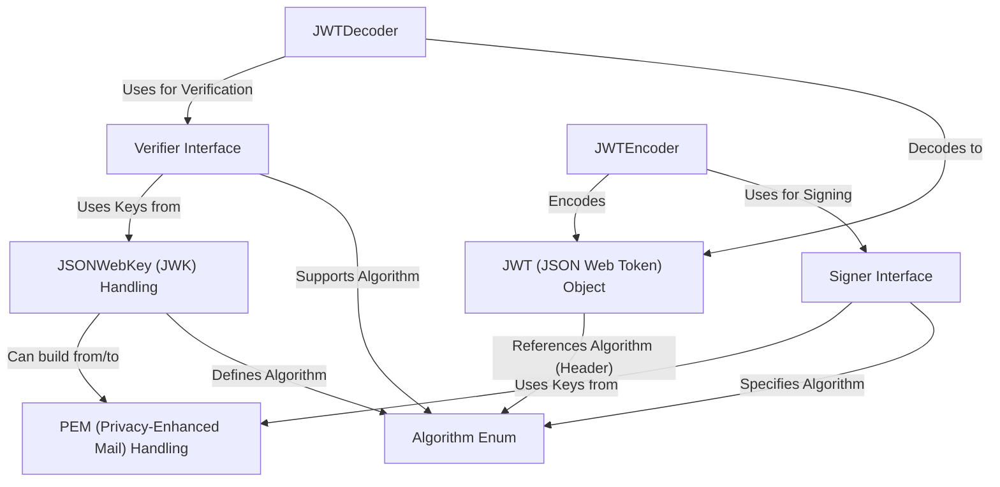

# Tutorial: fusionauth-jwt 

This project provides tools to create, sign, encode, and verify **JSON Web Tokens (JWTs)**.
Think of it like a digital passport system: you can *issue* a passport (`JWT` object), *stamp* it with a secret seal (`Signer`), *laminate* it into a compact string (`JWTEncoder`), and later *check* the seal and read the passport (`JWTDecoder` with a `Verifier`).
It supports various cryptographic **algorithms** (`Algorithm`) and handles cryptographic keys stored in different formats like *PEM* files (`PEM Handling`) or *JSON Web Keys* (`JWK Handling`).

**Source Repository:** [https://github.com/fusionauth/fusionauth-jwt](https://github.com/fusionauth/fusionauth-jwt)

## Chapters

1. [JWT (JSON Web Token) Object
](01_jwt__json_web_token__object_.md)
2. [Algorithm Enum
](02_algorithm_enum_.md)
3. [PEM (Privacy-Enhanced Mail) Handling
](03_pem__privacy_enhanced_mail__handling_.md)
4. [JSONWebKey (JWK) Handling
](04_jsonwebkey__jwk__handling_.md)
5. [Signer Interface
](05_signer_interface_.md)
6. [JWTEncoder
](06_jwtencoder_.md)
7. [Verifier Interface
](07_verifier_interface_.md)
8. [JWTDecoder
](08_jwtdecoder_.md)

---

Generated by [AI Codebase Knowledge Builder](https://github.com/The-Pocket/Tutorial-Codebase-Knowledge)
